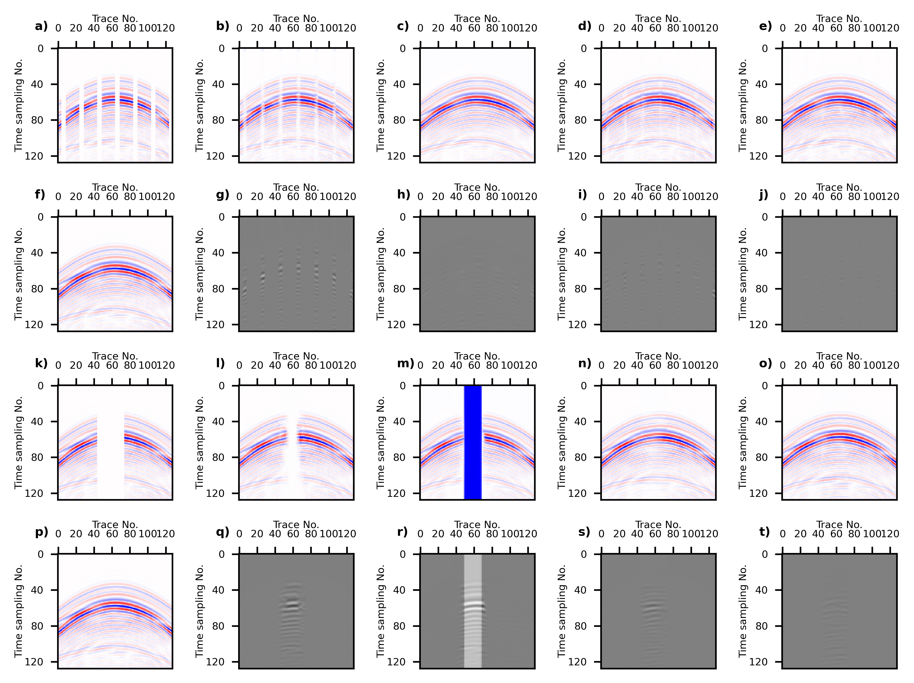
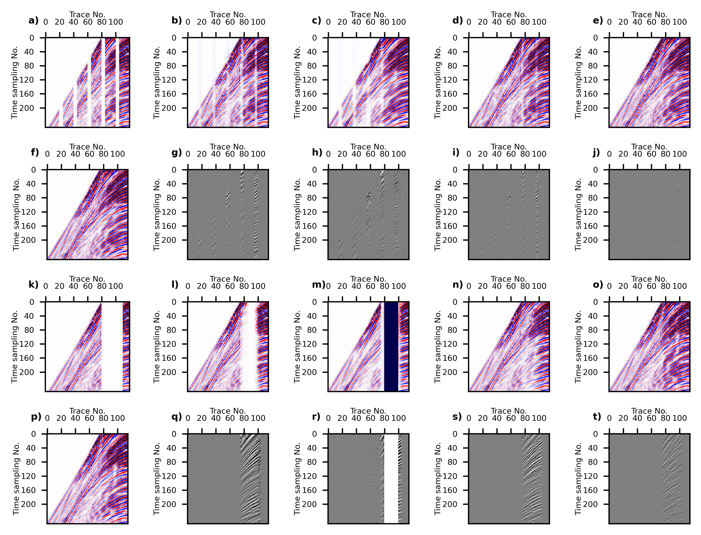

# Reconstruction
this is the code implementation of “Seismic Data Reconstruction Based On Conditional Constraint Diffusion Model”

# Result

### Synthetic data

[//]: # (![Synthetic data]&#40;./docs/Synthetic.png&#41;)

### Field data

# reconstruction your data

1. Use "train" to train your model and get the ".pt" model file.
2. Place the model file under "data/mod" in "reconstruction" and configure "confs" with the required configuration information.
3. Use "reconstruction" to reconstruct your data.